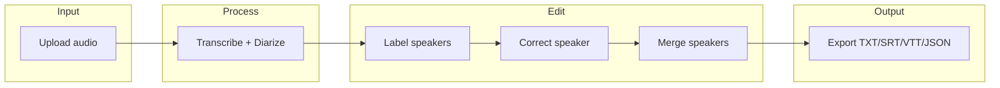

# Secretary: Transcription + Diarization GUI

## 1. GitHub repository

- **Action:** Create a new repository under your account ([TruthWarrior92](https://github.com/TruthWarrior92)) named **Secretary**.
- **Suggested:** Initialize with a README, add a `.gitignore` (Python, venv, `__pycache__`, `.env`, `*.wav`/audio samples, model caches), and a minimal project structure so the repo is cloneable from the start.

---

## 2. Tech stack and dependencies


| Layer       | Choice                               | Rationale                                                                                                                                                                                                                                                                                                        |
| ----------- | ------------------------------------ | ---------------------------------------------------------------------------------------------------------------------------------------------------------------------------------------------------------------------------------------------------------------------------------------------------------------- |
| GUI         | **CustomTkinter** or **PyQt6**       | CustomTkinter: simple, good-looking, pure Python. PyQt6: more powerful (tables, toolbars, docking). Recommend starting with CustomTkinter for speed; migrate to PyQt6 if you need richer editing (e.g. word-level timings).                                                                                      |
| ASR         | **openai-whisper**                   | Same as [pyannote-whisper](https://github.com/yinruiqing/pyannote-whisper): segment-level timestamps, well-supported.                                                                                                                                                                                            |
| Diarization | **pyannote.audio** Pipeline          | Use `pyannote/speaker-diarization` or `pyannote/speaker-diarization-3.1` (accept terms on Hugging Face; token required). Reuse the same idea as pyannote-whisper: Whisper segments + diarization annotation → assign speaker per segment, then optionally merge into sentences (see their `utils.diarize_text`). |
| Auth        | **Hugging Face token**               | Stored in `.env` or a small config (e.g. `~/.secretary/config`) and loaded when creating the Pipeline; never committed.                                                                                                                                                                                          |
| Packaging   | **pip + requirements.txt** or **uv** | Pin `openai-whisper`, `pyannote.audio`, `torch`, and GUI lib; document setuptools/speechbrain version constraints if you hit the same issues as pyannote-whisper (e.g. setuptools 59.5.0, speechbrain 0.5.16) for compatibility.                                                                                 |


---

## 3. Core data model and pipeline

- **In-memory model:** A list of “segment” objects, e.g. `{ start, end, text, speaker_id }`. `speaker_id` is the raw diarization label (e.g. `SPEAKER_00`) or a user-defined label (e.g. `Alice`).
- **Pipeline (same idea as pyannote-whisper):**
  1. Load audio (support WAV/MP3; normalize to 16 kHz mono for Whisper/pyannote if needed).
  2. Run Whisper `transcribe()` → segments with `start`, `end`, `text`.
  3. Run pyannote `Pipeline(audio_path)` → diarization `Annotation`.
  4. For each Whisper segment, assign speaker via the diarization annotation (e.g. crop segment, take dominant speaker).
  5. Optionally merge consecutive segments by same speaker and sentence boundaries (reuse or adapt `merge_sentence` from [pyannote_whisper/utils.py](https://github.com/yinruiqing/pyannote-whisper/blob/main/pyannote_whisper/utils.py)).
- **Best practices to apply:**
  - **Hugging Face:** Use token from env/config; document that user must accept model terms and create token at [hf.co/settings/tokens](https://huggingface.co/settings/tokens).
  - **Whisper:** Let user choose model size (tiny → large); default e.g. `base` or `small` for GUI responsiveness. Option for `language` (or auto-detect).
  - **Diarization:** Use a single pipeline run per file; optionally allow min_duration / min_duration_off to reduce very short spurious segments if the pipeline supports it.
  - **Threading:** Run transcribe + diarize in a background thread/worker and keep GUI responsive; show a progress indicator.
  - **Export:** Persist segment list (and speaker labels) to JSON; export to TXT (time + speaker + text), SRT, VTT for compatibility.

---

## 4. GUI layout and features




- **Upload:** File picker (and/or drag-and-drop); support WAV, MP3, FLAC, M4A. Show filename and duration.
- **Run pipeline:** Button “Transcribe & diarize”; progress bar or spinner; on completion, show a **segment table** (columns: start time, end time, speaker, text). Table should be **editable**: change speaker per row (dropdown or cell edit), and edit text if desired.
- **Label speakers:** Global mapping: e.g. `SPEAKER_00` → “Alice”, `SPEAKER_01` → “Bob”. Apply to all segments; show “Alice”/“Bob” in table and exports.
- **Correct speaker:** Per-segment override: user selects row(s) and assigns a different speaker (from current speaker set). Persisted in the in-memory segment list.
- **Merge speakers:** “Merge A into B”: every segment with speaker A becomes B; remove A from the speaker list. Useful when diarization split one person into two IDs.
- **Export:** Buttons or menu: Export as TXT (time + speaker + text), SRT, VTT, and JSON (full segment list with labels). Use same format as pyannote-whisper for TXT (e.g. `start end SPEAKER_00 text`) so outputs are interchangeable.

---

## 5. Suggested project structure

```
Secretary/
├── .env.example          # HUGGINGFACE_TOKEN=...
├── .gitignore
├── README.md
├── requirements.txt
├── secretary/
│   ├── __init__.py
│   ├── main.py            # GUI entry (e.g. CustomTkinter app)
│   ├── pipeline.py        # load_whisper, load_diarization, run_pipeline(audio_path) -> segments
│   ├── diarize_utils.py   # segment assignment + merge_sentence (adapt from pyannote-whisper)
│   ├── models.py          # Segment dataclass, speaker label map
│   └── export.py          # to_txt, to_srt, to_vtt, to_json
├── config.py              # paths, HF token from env
└── run.py                 # if __name__ == "__main__": launch GUI
```

---

## 6. Other functions that fit this tool

- **Playback sync:** Click a segment row to jump to that time in an embedded or external audio player (e.g. simple playback with `sounddevice`/`pyaudio` or open in system player at timestamp).
- **Search in transcript:** Text search across segments; highlight and scroll to match.
- **Re-run only diarization:** Keep Whisper result; re-run diarization (e.g. after changing pipeline params) and re-assign speakers without re-transcribing.
- **Import/export JSON:** Save and load project (audio path + segment list + speaker labels) to continue editing later.
- **Batch:** Queue multiple files; run pipeline on each; list results and open any in the editor.
- **Optional summarization:** Send transcript (or per-speaker) to a local or API summarizer (e.g. optional “Summarize” button; keep scope small to avoid scope creep).
- **Speaker colors:** Assign a color per speaker in the table for quick visual scanning.
- **Statistics:** Total time per speaker, segment count per speaker (simple stats panel).

Implement **playback sync** and **export (TXT/SRT/VTT/JSON)** first; then **label / correct / merge**; then add **search**, **re-run diarization**, and **JSON project save/load** as next steps.

---

## 7. Implementation order (high level)

1. Create GitHub repo **Secretary** and initial layout (README, .gitignore, `requirements.txt`, `secretary/` package).
2. Implement `config` + `pipeline` + `diarize_utils` (no GUI): load Whisper, load pyannote with token, run on one file, return list of segments.
3. Implement `models` (Segment, speaker map) and `export` (TXT, SRT, VTT, JSON).
4. Build minimal GUI: upload, run pipeline (background thread), show segment table (read-only).
5. Add editing: per-segment speaker override, global speaker labels, merge speakers.
6. Add export buttons and playback sync (or “open at time”).
7. Document in README: install, HF token setup, usage, and optional features (search, batch, summarization).

No code or repo creation will be done until you approve this plan; then you can run the repo creation and implement step by step.